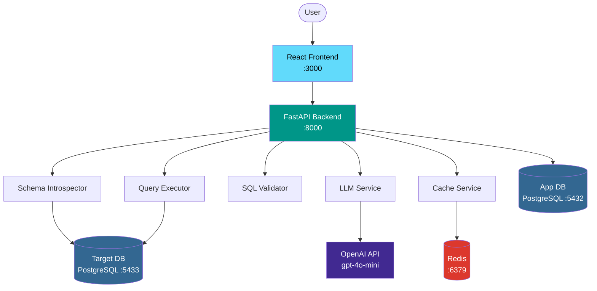
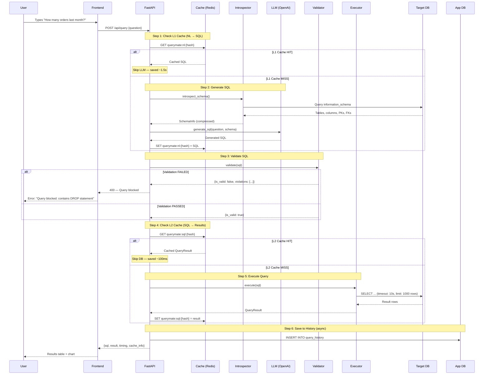
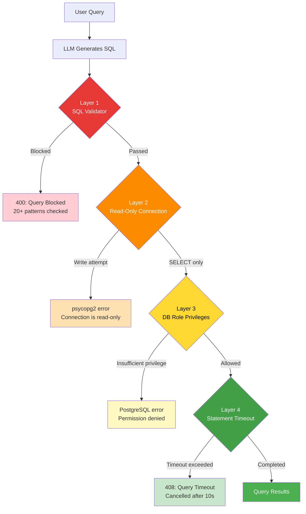
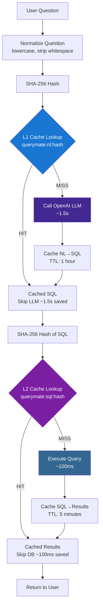
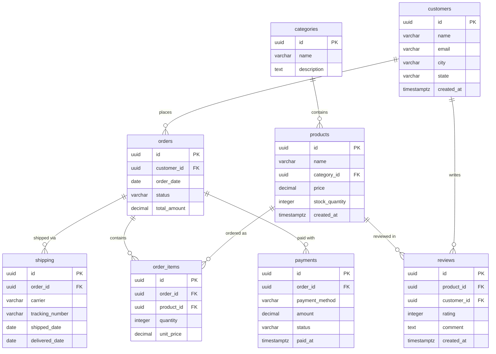

# QueryMate AI — System Architecture

## 1. System Overview

## 2. Request Flow — Query Execution

## 3. Security — Defense in Depth

## 4. Caching Strategy — Two-Level Cache

## 5. Data Model — E-Commerce Demo Schema

